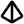

<h1 align="center">
  <picture>
    <source media="(prefers-color-scheme: dark)" srcset="web/pyramid_white.svg">
    
  </picture>
  GoTracer
</h1>

**A high-performance, concurrent 3D raytracing engine built entirely with the Go Standard Library.**

GoTracer is a physically-based renderer that transforms mathematical descriptions of 3D scenes into high-fidelity images. By leveraging Go’s world-class concurrency primitives and advanced spatial partitioning, GoTracer achieves professional-grade performance without a single external dependency.

<p align="center">
  <a href="https://opensource.org/licenses/MIT"></a>
  
  
</p>

---

## ✨ Key Features

* **⚡ Concurrency-First Architecture:** Utilizes Goroutines to parallelize ray casting across all available CPU cores, resulting in massive rendering speedups.
* **🚀 BVH Acceleration:** Implements **Bounding Volume Hierarchies** to reduce ray-object intersection tests from  to , enabling the rendering of complex scenes with thousands of objects.
* **💎 Realistic Materials:** * **Lambertian (Matte):** For soft, diffused surfaces.
* **Metal:** Supports adjustable fuzziness for polished or brushed finishes.
* **Dielectric (Glass):** Realistic refraction and reflection using Schlick's approximation.


* **📸 Advanced Camera System:** Features adjustable Field of View (FOV), focus distance, and aperture for cinematic **Depth of Field** effects.
* **🛠 Zero Dependencies:** Built using only the `math`, `image`, and `os` packages from the Go Standard Library.

---

## 🖼 Gallery

| **3D Mesh Scene** | **Earth and Moon Scene** |
| :---: | :---: |
|  |  |
| *High-poly mesh rendering with smooth shading and cloud-volumetric background.* | *Texture mapping and spherical projection featuring Earth and Moon coordinates.* |
| **Glass Balls** | **Cornell Box** |
|  |  |
| *Recursive ray-tracing demonstrating reflection, refraction, and Fresnel effects.* | *Global illumination test featuring area lighting and soft shadows.* |

## 🚀 Getting Started

### Prerequisites

* [Go](https://golang.org/doc/install) 1.18 or higher.

### Installation

```bash
git clone https://github.com/agoodyer/GoTracer.git
cd GoTracer

```

### Running the Tracer

Generate a render using the default scene configuration:

```bash
go run main.go

```

The output will be saved as `output.png` (or `.ppm`) in the project root.

---

## 📈 Performance Benchmarks

GoTracer was designed with a focus on optimization. By combining Go's concurrency model with BVH, we achieved a **36x speedup** over a naive single-threaded approach.

| Method | Scene Complexity | Time to Render |
| --- | --- | --- |
| Single-Threaded (Naive) | 500 Spheres | 12m 45s |
| **GoTracer (BVH + Concurrency)** | **500 Spheres** | **0m 21s** |

---

## 🛠 Project Structure

* `/pkg/vec3`: Custom 3D vector math library.
* `/pkg/hittable`: Intersection logic for spheres and BVH nodes.
* `/pkg/material`: Material properties and scattering functions.
* `/pkg/camera`: Viewport and ray generation logic.
* `main.go`: Scene setup and the concurrent rendering loop.

---

## ⚡ Performance & CPU Profiling

Raytracing is a computationally intensive task where performance is the primary constraint. To ensure **GoTracer** scales effectively, I utilized Go's built-in `pprof` suite to analyze execution hot paths and optimize the rendering pipeline.

### 🔍 Profiling Insights
The following call graph represents a high-resolution render of an STL mesh. By analyzing the stack, we can make several key observations about the engine's behavior:

* **Collision Bottlenecks:** As expected in a recursive raytracer, **96.7%** of CPU time is spent within the `ray_color` and `material.Bvh.Hit` stack.
* **BVH Efficiency:** The `material.(*Aabb).Hit` function accounts for **45.50%** of total execution time. This confirms that the Bounding Volume Hierarchy is successfully offloading the heavy lifting of intersection testing by performing rapid interval checks before attempting expensive triangle-mesh intersections.
* **Triangle Intersections:** The `objects.(*Tri).Hit` logic accounts for **26.18%** of the time, representing the actual barycentric coordinate calculations.
* **Compiler Optimization:** Several low-level math operations (such as `common.Dot`, `math.Abs`, and `common.(*Ray).At`) are marked as **(inline)**. This indicates that the Go compiler has successfully optimized these leaf functions, removing function-call overhead in the innermost loops.

<p align="center">
  
</p>

---

## 🗺 Roadmap

* [x] **Texture Mapping:** Support for image textures and procedural patterns (Perlin noise).
* [x] **Triangle Meshes:** Support for `.obj` file loading.
* [x] **Light Sources:** Implement emissive materials for true area lighting.
* [x] **Motion Blur:** Support for moving objects during the exposure interval.

---

## 🤝 Contributing

Contributions are welcome! Whether it's optimizing the renderer or adding new shapes, feel free to fork the repo and submit a PR.

## ⚖️ License

Distributed under the MIT License. See [LICENSE](./LICENSE) for more information.

---

**Developed by [Aidan Goodyer](https://github.com/agoodyer)**

---

